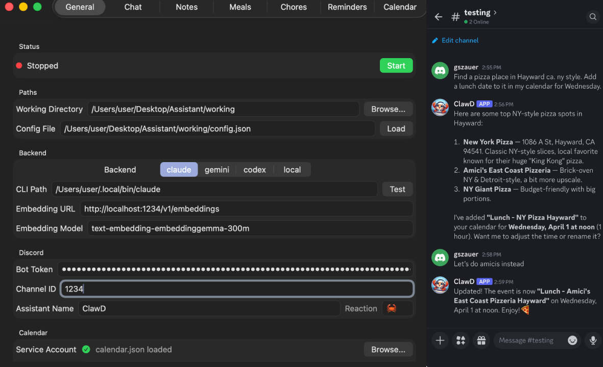

# ClawD

A native macOS personal assistant that connects to Discord, manages your calendar, meals, chores, reminders, and notes, and routes everything through an AI backend (Claude, Gemini, Codex, or a local LLM). Built as a C++17 core with a SwiftUI frontend.



## What It Does

- **Chat** with an AI assistant via Discord or the local app UI
- **Voice messages** — Discord audio messages are transcribed locally via whisper.cpp and processed as text
- **Image messages** — Discord image attachments are downloaded to `working/tmp/` and handed to Claude Code, which reads them via its Read tool; files are cleaned up after the response (Claude Code backend only)
- **Reminders** with one-time and recurring schedules (daily, weekly, monthly)
- **Meals** tracking with home/delivery categories and day-of-month scheduling
- **Chores** with color-coded categories, recurrence, and completion tracking
- **Notes** with semantic search powered by embeddings (HNSWLIB)
- **Google Calendar** integration via service account (create, edit, delete, query any date range)
- **Proactive messages** — daily reports, meal prep reminders, overdue chore alerts, end-of-day summaries
- **Desktop notifications** for reminders and scheduled reports

All data is stored as human-readable markdown files with YAML frontmatter. The AI can create, edit, and delete items via tool calls. You can also manage everything through the app's tabbed UI with an inline markdown editor.

## Requirements

- macOS (built and tested on macOS 26 / Apple Silicon)
- Xcode (for building the macOS app)
- One of: Claude CLI, Gemini CLI, Codex CLI, or a local OpenAI-compatible API
- Optional: LM Studio or similar for embeddings
- Optional: Discord bot token for Discord integration
- Optional: Google Cloud service account for calendar sync

## Quick Start

### 1. Build

**macOS App (recommended):**
```bash
open clawd.xcodeproj
# Build and run from Xcode (Cmd+R)
# The .app is output to the project root
```

**CLI only (Phase 1 testing):**
```bash
make
./assistant [path/to/config.json]
```

### 2. Configure

On first launch, the app creates a `working/` directory next to the `.app` bundle with default settings. The General tab lets you configure:

- **Backend** — select Claude / Gemini / Codex / API and set the CLI path or API URL
- **Embedding** — API server or local GGUF model for semantic note search
- **Audio** — whisper.cpp for voice message transcription (off by default)
- **Discord** — bot token and channel ID (numeric, right-click channel > Copy ID)
- **Calendar** — browse for Google service account JSON, enter your calendar ID
- **Notifications** — enable/disable and set times for daily report, meal prep, etc.
- **Advanced** — chat history length, heartbeat interval, note search result count

Click **Start** to initialize the core and connect to Discord.

### 3. Set Up AI Backend

The app needs at least one AI backend to generate responses.

**Claude CLI** (default):
```bash
# Install via the Claude installer
# Default path: ~/.local/bin/claude
# Web search is enabled automatically
```

**Gemini / Codex** (npm):
```bash
npm install -g @anthropic-ai/gemini-cli
npm install -g @openai/codex
# Default paths: /opt/homebrew/bin/gemini, /opt/homebrew/bin/codex
```

**Local API** (e.g. LM Studio):
- Set backend to "API"
- API URL: `http://localhost:1234/v1/chat/completions`
- Optional: API key and model name

Use the **Test** button next to the CLI path field to verify the backend is installed.

### 3b. Set Up Audio Transcription (Optional)

Voice messages sent on Discord can be transcribed locally using whisper.cpp.

1. Set the Audio toggle to **whisper**
2. Click **Base** or **Small** to download a whisper model, or **Browse** to select your own
3. Click **Save Config**, then **Start**

When a voice message is received, ClawD adds an ear emoji, transcribes the audio, passes the transcript to the AI, and posts both the AI response and the transcript to Discord.

### 4. Set Up Discord (Optional)

1. Create a bot at [discord.com/developers/applications](https://discord.com/developers/applications)
2. Under **Bot** > **Privileged Gateway Intents**, enable **Message Content Intent**
3. Copy the bot token into the General tab
4. Invite the bot to your server
5. Right-click the target channel > **Copy Channel ID** (requires Developer Mode in Discord settings)
6. Paste the channel ID

### 5. Set Up Google Calendar (Optional)

1. Create a project in [Google Cloud Console](https://console.cloud.google.com/)
2. Enable the **Google Calendar API**
3. Create a **Service Account** and download the JSON key
4. In ClawD, click **Browse** in the Calendar section and select the JSON file
5. The service account email appears — share your Google Calendar with it (Settings > Share with specific people > "Make changes to events")
6. Enter your **Calendar ID** (found in Calendar Settings > Integrate calendar — it's an email address or a `@group.calendar.google.com` identifier)

Without Google credentials, the calendar still works locally — events are stored in `calendar_cache.json` and displayed with an orange "local" badge.

### 6. Set Up Embeddings (Optional)

Semantic note search uses an embedding model. Two modes are available:

**API** (default) — any OpenAI-compatible endpoint (e.g. LM Studio):
1. Install [LM Studio](https://lmstudio.ai/) and load an embedding model
2. Start the server (default: `http://localhost:1234`)

**Local** — runs the model in-process via llama.cpp:
1. Set Embedding to **local**
2. Click **Download** to fetch nomic-embed-text-v1.5, or **Browse** for your own GGUF
3. Reindex notes from the Notes tab

Without embeddings, notes still work — search falls back to title matching.

## Project Structure

```
Assistant/
  core/           C++ core (config, data stores, tools, prompt assembly,
                  calendar, note search, backend execution, task queue)
  clawd/          Swift UI layer (tabs, services, state management)
  Makefile        Builds the standalone CLI binary
  clawd.xcodeproj Xcode project for the macOS app
```

### Core (C++17)

| Component | Files | Purpose |
|-----------|-------|---------|
| Config | `config.h/cpp` | Loads `config.json`, holds all settings |
| Data Store | `data_store.h/cpp`, `frontmatter.h/cpp` | Generic CRUD for markdown files with YAML frontmatter |
| Chat History | `chat_history.h/cpp` | Daily markdown chat logs, tail loading |
| Tool System | `tool_parser.h/cpp`, `tool_handler.h/cpp`, `tool_handlers.h/cpp` | 23 tool handlers with `<<TOOL:...>>` parsing |
| Prompt Assembly | `prompt_assembler.h/cpp` | Builds multi-part prompts from templates + context |
| Note Search | `note_search.h/cpp` | HNSWLIB semantic search with embedding API |
| Local Embed | `local_embed.h/cpp` | llama.cpp local embedding inference |
| Whisper | `whisper_transcribe.h/cpp` | whisper.cpp audio transcription |
| Calendar | `calendar.h/cpp` | Google Calendar API, sync tokens, local fallback |
| Backend | `backend.h/cpp` | CLI (`popen`) and API (HTTP POST) execution |
| Task Queue | `task_queue.h/cpp` | Priority queue for scheduled tasks |
| HTTP Client | `http_client.h/cpp` | POSIX socket HTTP for Phase 1 |
| Core API | `core.h/cpp` | C-compatible interface, global state, message routing |
| Dependencies | `cJSON.c/h`, `hnswlib/` | JSON parsing, nearest neighbor search |
| Pre-built Libs | `deps/lib/`, `deps/include/` | llama.cpp + whisper.cpp static libraries |

### Swift Layer

| Component | Files | Purpose |
|-----------|-------|---------|
| App | `clawdApp.swift`, `ContentView.swift` | Entry point, 7-tab layout, toast overlay |
| State | `AppState.swift` | `@Observable` singleton, config I/O, data refresh |
| Bridge | `CoreBridge.swift`, `clawd-Bridging-Header.h` | C++ core wrapper, platform callbacks |
| Discord | `DiscordService.swift` | WebSocket gateway, heartbeat, REST API |
| Calendar Auth | `CalendarAuth.swift` | Service account JWT (RS256), token exchange |
| Notifications | `NotificationService.swift` | Desktop notifications |
| Timers | `TimerService.swift` | Timer callback bridging |
| Validation | `EditHelpers.swift` | Frontmatter validation on edit |
| UI Tabs | `GeneralTab.swift`, `ChatTab.swift`, `NotesTab.swift`, `MealsTab.swift`, `ChoresTab.swift`, `RemindersTab.swift`, `CalendarTab.swift` | All UI views |

## Tool Reference

The AI can invoke these tools by including `<<TOOL:name(params)>>` in its response.

### Reminders
| Tool | Parameters | Description |
|------|-----------|-------------|
| `set_reminder` | message, datetime, recurrence | Create a reminder. Recurrence: once/daily/weekly/monthly |
| `list_reminders` | count | List upcoming reminders |
| `edit_reminder` | id, message, datetime, recurrence | Edit a reminder |
| `delete_reminder` | id | Delete a reminder |

### Meals
| Tool | Parameters | Description |
|------|-----------|-------------|
| `add_meal` | name, type, content, days | Add a meal. Type: home/delivery |
| `get_meals` | date | Get meals for a date |
| `get_meal_details` | id | Get full recipe/details |
| `edit_meal` | id, name, type, content, days | Edit a meal |
| `delete_meal` | id | Delete a meal |
| `swap_meal` | date, slot | Switch meal for a date |

### Chores
| Tool | Parameters | Description |
|------|-----------|-------------|
| `add_chore` | name, color, recurrence, day | Add a chore. Colors: green/blue/pink |
| `edit_chore` | id, name, color, recurrence, day | Edit a chore |
| `complete_chore` | id | Mark done (one-shot chores are deleted) |
| `list_chores` | date | List chores for a date |
| `delete_chore` | id | Delete a chore |

### Notes
| Tool | Parameters | Description |
|------|-----------|-------------|
| `save_note` | title, content, tags | Save a note (generates embedding) |
| `edit_note` | id, title, content, tags | Edit a note (re-indexes embedding) |
| `search_notes` | query | Semantic search (or title match if no embeddings) |
| `list_notes` | | List all notes |
| `delete_note` | id | Delete a note (removes from index) |

### Calendar
| Tool | Parameters | Description |
|------|-----------|-------------|
| `get_calendar` | start_date, end_date | Query Google Calendar live for any date range |
| `create_calendar_event` | title, datetime, duration_minutes, recurrence | Create event. Recurrence: DAILY/WEEKLY/MONTHLY/YEARLY |
| `edit_calendar_event` | id, title, datetime, duration_minutes | Edit an event |
| `delete_calendar_event` | id | Delete an event |

## Prompt Templates

The system prompt and user profile are stored as editable markdown files in `working/prompts/`. Changes take effect on next app start.

| File | Purpose |
|------|---------|
| `system_prompt.md` | AI personality, tool instructions, format rules |
| `profile.md` | User preferences (dietary, schedule, chore meanings) |
| `notes.txt` | Reference: lists supported `{{variables}}` |

Supported variables: `{{assistant_name}}`, `{{datetime}}`, `{{date}}`, `{{day_of_week}}`, `{{tools}}`

## Data Storage

All user data is human-readable markdown with YAML frontmatter, stored in the `working/` directory. Files can be edited externally with any text editor. Changes are picked up when the data stores are reloaded.

Filenames use slugified titles with a random 6-digit hex suffix to prevent collisions (e.g. `call_dentist_a3f1b2.md`).

## Graceful Degradation

The app is designed to run with missing components:

| Missing | What happens |
|---------|-------------|
| AI backend | Chat shows error messages, tools still work from UI |
| Discord | Local chat UI works, proactive messages go to chat log + desktop notifications |
| Embedding server | Note search falls back to title matching, no auto-injection in prompt |
| Whisper model | Voice messages are downloaded but not transcribed |
| Claude Code backend | Image attachments on Discord are silently ignored (API/gemini/codex backends don't go through the image flow) |
| Google Calendar | Calendar tools use local-only storage, events show orange badge |
| Config file | Default settings used, config created on first save |

## Building

### macOS App
```bash
# From Xcode
open clawd.xcodeproj
# Cmd+R to build and run
# Output: ./clawd.app (in project root)
```

### CLI Binary
```bash
make          # Build
make clean    # Clean
./assistant   # Run with default config
./assistant -c config.json -w ./working  # Custom paths
```

### Build Settings

The Xcode project is configured with:
- `CONFIGURATION_BUILD_DIR = $(SRCROOT)` — .app builds to project root
- `HEADER_SEARCH_PATHS = $(SRCROOT)/core, $(SRCROOT)/deps/include` — finds C++ and library headers
- `LIBRARY_SEARCH_PATHS = $(SRCROOT)/deps/lib` — llama.cpp and whisper.cpp static libraries
- `SWIFT_OBJC_BRIDGING_HEADER = clawd/clawd-Bridging-Header.h`
- `GCC_PREPROCESSOR_DEFINITIONS = NO_MANUAL_VECTORIZATION` — HNSWLIB ARM compatibility
- `ENABLE_APP_SANDBOX = NO` — required for file and network access
- `core/main.cpp` excluded from Xcode build (has its own `main()`)

## License

Personal project. Not licensed for redistribution.
